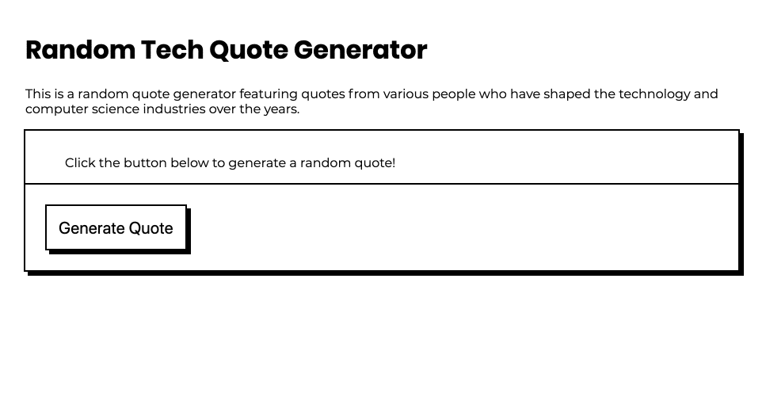

#G
 Random Quote Generator Exercise

This is a random quote generator featuring quotes from various people who have shaped the technology and computer science industries over the years. 

## Exercise

In the exercise folder, add JavaScript to the app.js file to make your random quote generator work. To see a solution, check in the solution folder. 

## Additional Exercises

Below are some suggestions for additional exercises you can complete to make this project your own.

1. **Update the quotes.** Change the quotes to match your favorite movies, TV shows, song lyrics or other influential people. 
2. **Update the styling.** Update the black and white color scheme to something more interesting! Add a background image or try a monochrome theme!
3. **Enhance the quotes.** Right now, the quotes just have the quote text and the name of the person that said the quote. Try adding in a year. Or an image for each person. Or a link to a video of them saying the quote (or even a video embed).
4. **Add interactivity.** Say a user really likes a quote and wants to save it. If they leave the page or refresh, they will have to click the generate quote button over and over until they find that quote again. Try adding in a Tweet this Quote or Email this Quote button so that people can send the quotes that they like. 
5. **Add multiple quote generators to the same page.** Add another quote generator! If you want to keep with the tech theme, you could have one with quotes from computer scientists, one with quotes from mathematicians, or one with quotes from women in technology, etc. This could involve creating multiple quote variables, or adding a key to your object to identify categories. You will also need to modify your HTML and click event listeners. 
6. **Pull quotes from an API.** Instead of manually adding the quotes into your JavaScript file like we have done here, try to connect to an API (which is like a public database) to pull more quotes into your project dynamically. 

## Resources

[ Add resources here ]
